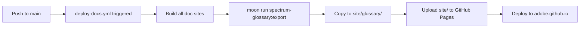

# Glossary Deployment Integration

## Summary

The Spectrum Design System Glossary has been integrated into the main documentation deployment workflow, allowing it to be deployed to GitHub Pages alongside other doc sites.

## Changes Made

### 1. Added Export Task to `moon.yml`

```yaml
export:
  command: ./scripts/export-to-site.sh
  deps:
    - ~:build
  platform: system
  outputs:
    - /site/glossary/
```

This task exports the built glossary from `dist/` to `../../site/glossary/` for GitHub Pages deployment.

### 2. Created Export Script

**File**: `scripts/export-to-site.sh`

```bash
#!/bin/sh
set -e

# Create site directory structure
mkdir -p ../../site
rm -rf ../../site/glossary
mkdir -p ../../site/glossary

# Copy built files
cp -r dist/* ../../site/glossary/

echo "✓ Exported glossary to site/glossary/"
```

This script safely creates the target directory and copies all built files.

### 3. Updated Docs Deployment Workflow

**File**: `.github/workflows/deploy-docs.yml`

Added one line after the other doc builds:

```yaml
- run: moon run spectrum-glossary:export
```

This integrates the glossary into the existing deployment pipeline that builds:

* site (Next.js docs)
* visualizer
* s2-visualizer
* viewer (s2-tokens-viewer)
* release-timeline
* **glossary** (NEW)

### 4. Removed Separate Workflow

**Deleted**: `.github/workflows/deploy-glossary.yml`

No longer needed since the glossary is now part of the main docs deployment.

## Deployment Flow



## Testing

Successfully tested the export task:

```bash
$ cd /Users/garthdb/Spectrum/spectrum-design-data
$ moon run spectrum-glossary:export

▪▪▪▪ spectrum-glossary:build (2s 880ms)
▪▪▪▪ spectrum-glossary:export (1s 296ms)
✓ Exported glossary to site/glossary/

Tasks: 2 completed
Time: 8s 391ms
```

**Verification**:

* 726 files exported to `site/glossary/`
* Includes all HTML pages, assets, and API endpoints
* Directory structure preserved

## URLs

After deployment, the glossary will be accessible at:

* **Homepage**: <https://adobe.github.io/spectrum-design-data/glossary/>
* **Terms**: <https://adobe.github.io/spectrum-design-data/glossary/terms/{registry}/{termId}/>
* **Categories**: <https://adobe.github.io/spectrum-design-data/glossary/categories/{category}/>
* **API**: <https://adobe.github.io/spectrum-design-data/glossary/api/v1/>

## Benefits

1. **Unified Deployment**: All docs deploy together, reducing complexity
2. **Consistent Workflow**: Uses same CI/CD pipeline as other doc sites
3. **Automatic Updates**: Deploys whenever registry or glossary changes
4. **Single Pages Configuration**: No need to manage multiple GitHub Pages deployments

## Deployment Triggers

The glossary will be deployed when:

1. **Push to main**: Any changes to the repository
2. **After Release**: Automatically after the Release workflow completes
3. **Manual**: Via workflow\_dispatch in GitHub Actions UI

## Next Steps

Once this PR is merged:

1. The workflow will automatically deploy the glossary on next push to main
2. The glossary will be accessible at the GitHub Pages URL
3. Future updates to the registry or glossary will automatically redeploy

***

**Status**: ✅ Ready for deployment\
**Last Updated**: 2026-01-13\
**Moon Integration**: Complete\
**CI/CD Integration**: Complete
